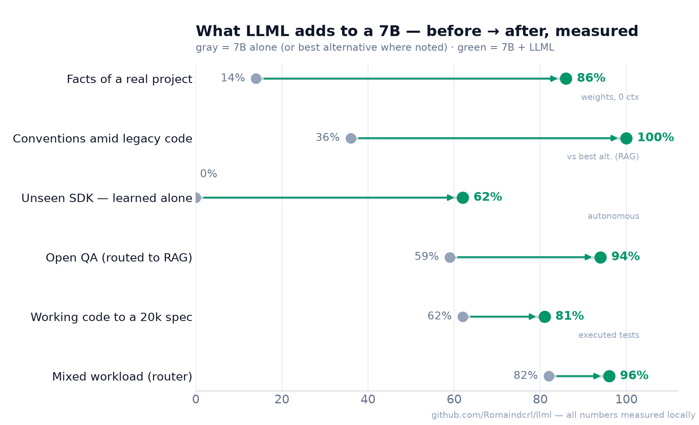
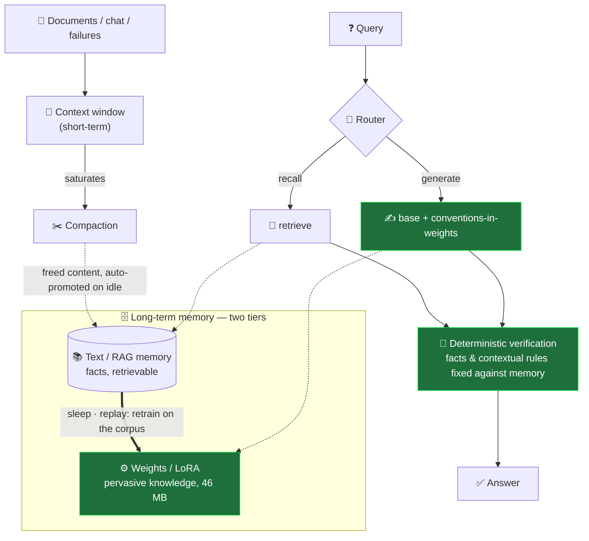
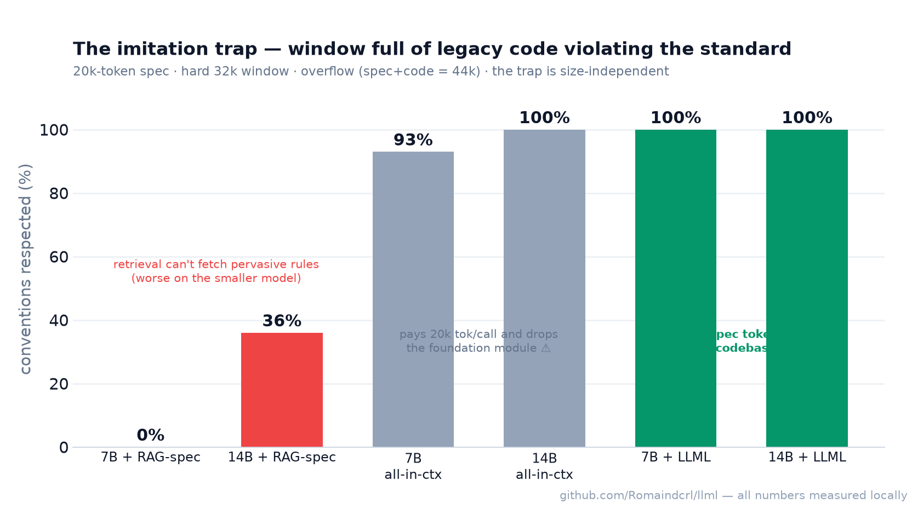
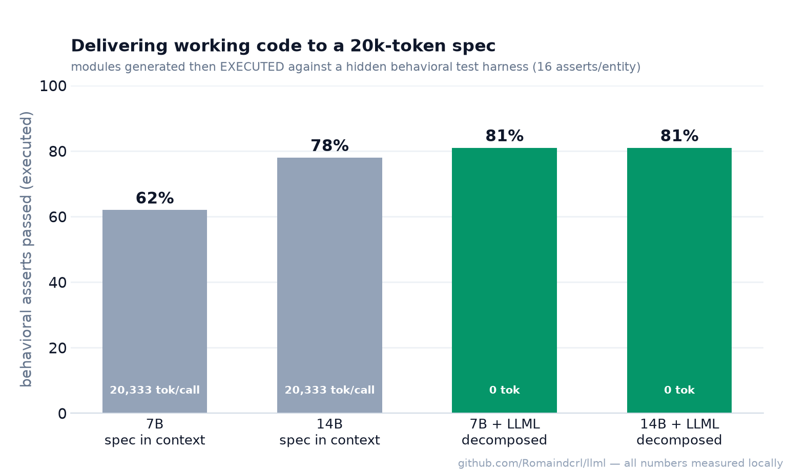
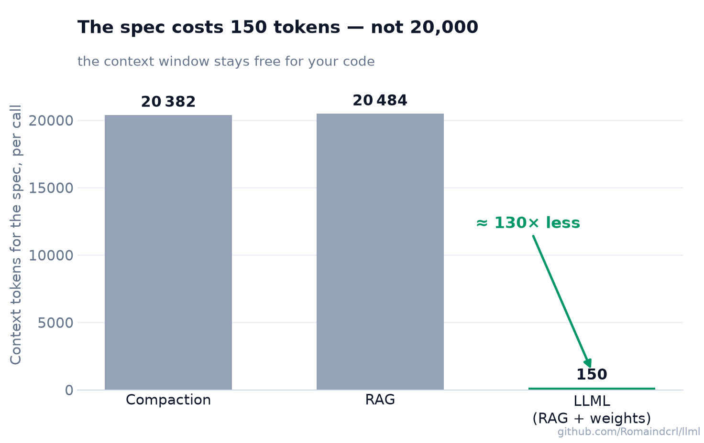
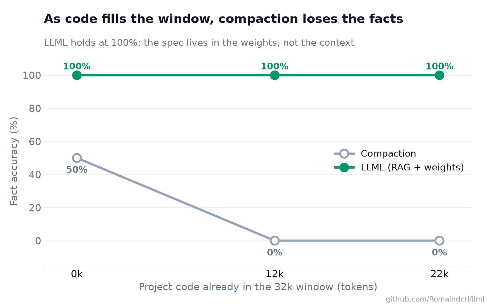
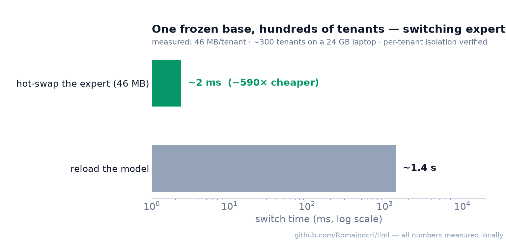
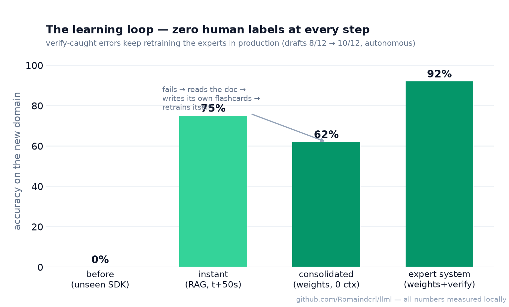

<div align="center">

# LLML

### Long-term memory for local LLMs — knowledge in the *weights*, facts in *external memory*, and a system that learns on its own.


**A 7B model on a laptop that knows your project by heart, follows your 20,000-token spec for
0 context tokens, teaches itself domains it has never seen, and serves ~300 isolated tenants
from one frozen base — with the benchmarks that prove it, including the ones we lost.**

[The numbers](#-the-numbers) · [How it works](#-how-it-works) · [Flagship results](#-flagship-results) ·
[It learns alone](#-it-learns-on-its-own) · [Every benchmark](#-every-benchmark-we-ran) ·
[Honest boundaries](#-the-honest-boundaries) · [Quickstart](#-quickstart)

</div>

---



Small local models aren't dumb — they're **amnesiac**. Every call, they rediscover your project
from a context window that your codebase is already fighting for. LLML gives them a two-tier
long-term memory inspired by how brains consolidate during sleep: **stable knowledge (your spec,
your conventions, your APIs) is trained into the weights** as a 46 MB adapter — free at
inference, forever — while **volatile facts stay in external memory**, retrieved and *verified*
on demand. A router decides, per request, which tier answers.

Everything below was measured on consumer hardware (M-series Mac, MLX, qwen2.5 7B/14B) and is
reproducible from [`scripts/`](scripts). We publish the losses with the wins — that's the point
of the repo.

## 📊 The numbers

| Capability | 7B alone | **7B + LLML** | Gain |
|---|---|---|---|
| Facts of a real project (private SaaS spec) | 14% | **86%** — weights, 0 ctx | **+72 pts** |
| Conventions amid legacy code | 36% *(best alt.: RAG)* | **100%** | **+64 pts** |
| Learning an unseen SDK, autonomously | 0% | **62%** (75-88% instantly w/ RAG) | **+62–88** |
| Known facts at 0 context (needle recall) | ~0% | **100%** | **+100** |
| Open QA (SQuAD, real questions) | 59% | **94%** — router → RAG | **+35** |
| Following a 20k-token spec while generating | 0 / 0 | **100 / 100** @ ~110 tok | **+100** |
| 32k overflow (spec + code > window) | compaction: facts **0%** | **100/100**, foundation kept | structural |
| Mixed workload (facts + codegen, routed) | 82% best single | **96%** | **+14** |
| Improving with use (errors → retraining) | drafts 8/12 | **10/12 — zero human labels** | **+17** |
| Spec cost, per call | 20,333 tok | **0–150 tok** | **~135×** |

**Programming, precisely** — three different things people mean by "coding ability":

| | 7B alone | 7B + LLML | |
|---|---|---|---|
| Code **to a spec** (executed behavioral tests) | 62% | **81% — beats a 14B with the full spec in context (78%)** | ✅ |
| Code **with an unknown framework** | 53% | **82%** (router sends generation to *context*, never weights) | ✅ |
| **HumanEval** (public benchmark, official tests) | 92% | **98%** — the verification loop repairs against documented examples | ✅ **+6 pts** |
| **Raw algorithmic skill** | parser 0/16 | unchanged — and −17…−50 pts if attempted via weights | ❌ refuted, 5× |

And the HumanEval trio that *is* the whole philosophy in three numbers — same model, same adapter:
**always-on adapter 8%** (naive weight-memory is dangerous) → **routed 92%** (the MoE router
sent 40/40 out-of-domain tasks to the bare model) → **verified 98%** (the system repairs its
own drafts against available ground truth).

> **Bottom line: LLML turns a generalist 7B into a project specialist that matches a model twice
> its size — on project work — learns new domains alone, improves with use, in 46 MB per tenant
> at zero recurring context cost. Its raw IQ doesn't move; we measured that too, five times.**

## 🧠 How it works



Complementary Learning Systems, operationalized: context = hippocampus, weights = neocortex,
`/sleep` = consolidation by replay. Four pillars, each carrying measured weight:

1. **Knowledge in the weights** — the spec lives in a LoRA: 0 tokens forever, load-invariant
   (same score at 0 and 20k tokens of noise), immune to the imitation trap below.
2. **RAG + router + verification** — the unpredictable stays retrievable (SQuAD 94%); a
   deterministic verify pass fixes exact values against memory (67% → 92% on the expert system,
   closed a cross-file rule from 0% → 100%). Generation is *never* routed to weights — we
   measured why, five times.
3. **Autonomous learning** — failure-triggered self-study + sleep consolidation (next section).
4. **A mixture of LoRA experts** — one frozen base, one 46 MB expert per domain/client,
   routed per request, hot-swapped in ~2 ms.

## 🏆 Flagship results

### The imitation trap — where retrieval structurally fails
Fill the window with legacy code that violates your standard (the real "migrate this codebase"
scenario, at 32k overflow). Retrieval can't fetch *pervasive* rules — they're lexically related
to no query — and the model imitates the legacy style around it:



Same result on the 7B and the 14B: **LLML doesn't compete with the biggest model you can run —
it rides it.** (Training the spec-LoRA on the 14B took 9 minutes on a MacBook.)

### Delivering working code — evaluated by execution, not by grep
Modules generated against the 20k-token spec, then **executed** in a behavioral harness
(nominal flow, exact error codes, exact repo methods, validation — 16 asserts per entity):



### The window stays yours
The spec never competes with your code for context: at 31k of accumulated code (hard 32k
window), compaction's facts collapse 50% → **0%** and every in-context method drops the
project's foundation module; LLML holds **100/100 and keeps the whole codebase** —
the spec costs ~150 tokens instead of ~20,000, on *every single call*:




### One base, hundreds of tenants


OpenAI-compatible endpoint, tenant picked by header, isolation verified (each expert knows
nothing about the others): [`scripts/serve_multitenant.py`](scripts/serve_multitenant.py).

## 🔁 It learns on its own

The loop that makes the system alive: **fail → read the doc → write its own flashcards →
retrain itself → retry.** Zero human labels at any step. In production, every error caught by
the verification pass becomes training data for the next sleep cycle — knowledge migrates from
retrieval into weights *through use* (expert drafts improved 8/12 → 10/12 autonomously).



The bottleneck is the **study strategy**, not the training: naive self-study plateaus at
12-38%; the structured recipe (overview + per-fact flashcards + paraphrase augmentation)
reaches 62% — and the same recipe took needle-recall from 20% to 100%.

## 🧾 Every benchmark we ran

Full tables and honest takeaways in [`BENCHMARKS.md`](BENCHMARKS.md). The one-line index:

| # | Question | Result | Script |
|---|---|---|---|
| 1 | Homemade QA (kept as a bias cautionary tale) | weights "100%" — an artifact | `benchmark.py` |
| 2 | Real open QA (SQuAD) | **RAG 94%** ≫ weights 44% → router | `benchmark_squad.py` |
| 3 | Codegen w/ unknown framework | context 82% ≫ weights 6-24% (**FT degrades**) | `benchmark_code_v2.py` |
| 4 | Can a router tell recall from generation? | 93%, 0/32 misroutes | `router_eval.py` |
| 5 | Conventions + facts from one spec | **2-step 100/100** (RAG 29% conv) | `benchmark_spec_final.py` |
| 6-7 | 20k spec + code filling a hard 32k window | **100/100 @150 tok**; compaction facts → 0% | `benchmark_project.py` |
| 8 | Is capability the memory's job? | No — parser 0/16 regardless (14B: 15/15) | `demo_codeproject.py` |
| 9 | Can weights store facts reliably? | **Yes — 20% → 100%**, recipe is the lever | `benchmark_niah_v2.py` |
| 10 | Where should stable knowledge live? | weights **+19** where system prompt does **−19** | `benchmark_split*.py` |
| 11 | Can compression preserve structure? | Refuted on real data — kept as negative result | `benchmark_structcompact*.py` |
| 12 | Can it learn an unseen SDK alone? | **0% → 62%**, capability probes unchanged | `benchmark_selfimprove.py` |
| 13 | Small docs, big model baseline | 14B+doc wins — regime boundary, documented | `benchmark_llml_loop.py` |
| 14 | Self-improving expert library | routing 100%, system **92%**, drafts 8→10 alone | `serve_multitenant.py`¹ |
| 15 | Does 20k of context load erode knowledge? | weights & experts invariant (so is clean in-ctx) | ¹ |
| 16 | Can LoRA buy code *skill*? | **No — 5 convergent refutations** | `benchmark_code_skills*.py` |
| 17 | Legacy codebase (imitation trap) | RAG 36% vs **LLML 100%**, both models | `benchmark_bigctx2*.py` |
| 18 | Working code to spec, executed | **81% ≥ 14B-in-context 78%, at 0 tok** | `benchmark_realtask*.py` |
| 19 | Public certification (HumanEval pass@1) | always-on adapter **8%** · routed **92%** · **+verify 98%** | `benchmark_humaneval*.py` |

¹ *run against a real private project spec — those scripts are withheld, numbers reported.*

## ⚖️ The honest boundaries

Knowing where a tool stops is what makes it usable. Ours, measured:

- **A few hundred tokens of reference? Just put them in context.** In-context beats everything
  when the doc is small and handy (incl. under 20k of clean load). LLML pays off when knowledge
  is **big** (20k-token specs), **repeated** (every call), **contradicted by the surroundings**
  (legacy code), or **multiplied** (N clients).
- **Memory ≠ intelligence.** The weights store what the model *knows*, not how well it
  *reasons*. Hard algorithms need a stronger base — and LLML rides it (proven on the 14B).
  Training code skill into a small quantized model made it measurably worse, every time we tried.
- **Baked style is rigid.** A spec-LoRA imposes its learned skeleton — it once ignored a novel
  in-context rule until the verification pass was extended to enforce it. Decomposition +
  verification aren't accessories; they're the pieces that make the weights usable.
- **The recipe matters.** Naive training gets 14%; coverage + paraphrase augmentation gets
  86%. Budget for it (it's automatable — that's what `/sleep` does).
- **Ns are small** (8-40 items per bench), models are local, one family (qwen2.5). Directional
  and fully reproducible — not a paper's evaluation suite.

## 🚀 Quickstart

```bash
uv venv --python 3.12 .venv && . .venv/bin/activate
uv pip install mlx-lm httpx fastapi uvicorn numpy
# grab an MLX model, e.g. mlx-community/Qwen2.5-7B-Instruct-8bit -> models/qwen2.5-7b-it-mlx-8bit

# single-assistant server (OpenAI-compatible — point Open WebUI at http://localhost:8000/v1)
M0_BACKEND=mlx M0_MLX_MODEL_PATH=models/qwen2.5-7b-it-mlx-8bit ./.venv/bin/python scripts/serve.py

# multi-tenant server (one base, one 46MB expert per tenant, ~2ms switch)
./.venv/bin/python scripts/serve_multitenant.py
curl localhost:8001/v1/chat/completions -H 'X-Tenant: <tenant>' -H 'Content-Type: application/json' \
     -d '{"messages":[{"role":"user","content":"..."}]}'
```

No model handy? `./.venv/bin/python scripts/smoke.py` runs everything on a deterministic mock.

**Then just use it.** Paste your framework docs or coding standard and chat: documents are
auto-indexed into RAG and digested into long-term memory in the background while you're idle
(*sleep-time compute*). `/remember` and `/sleep` exist as manual overrides;
weight-consolidation is opt-in (`M0_AUTO_SLEEP=1`) because for facts, RAG wins — we measured it.

| Command | Effect |
|---|---|
| `/remember` | force a document into long-term memory now |
| `/sleep` | consolidate the corpus into a LoRA (replay) and hot-swap it |
| `/ctxt_clear` | clear context, keep weights + memory (test weight-recall) |
| `/reset` · `/info` · `/state` · `/help` | maintenance |

| Env var | Default | Role |
|---|---|---|
| `M0_BACKEND` | `mock` | `mock` \| `mlx` \| `ollama` |
| `M0_MLX_MODEL_PATH` | `models/mlx-3b-4bit` | MLX model dir |
| `M0_AUTO_LEARN` | `1` | auto-index docs + background long-term memory |
| `M0_AUTO_SLEEP` | `0` | opt-in: auto-consolidate to weights when idle |
| `M0_GATE_ACQ` | `0.45` | acquisition gate for `/sleep` (held-out, anti-leak) |

## 📚 Prior art & what's actually ours

None of the individual techniques are novel, and we verified the neighbors by hand:
RAG-vs-FT (arXiv:2312.05934), RAFT (2403.10131), generate-then-verify (2410.15667),
self-adapting LMs / SEAL (2506.10943), parametric RAG (2501.15915), multi-tenant LoRA serving
(S-LoRA 2311.03285, Punica 2310.18547), CLS-inspired memory (HippoRAG 2405.14831),
sleep-consolidation (2606.03979). What we found nowhere else: the **assembled, working,
honestly-measured system** — a stable/volatile router that actually exists, a per-client LoRA
that is the *artifact of a sleep cycle* rather than a frozen fine-tune, and the benchmark
suite that documents where it wins *and where it loses*.

## 👤 Author

**Romain Decrand--Lardière** — local LLM memory R&D.
MIT © 2026 — see [`LICENSE`](LICENSE).
