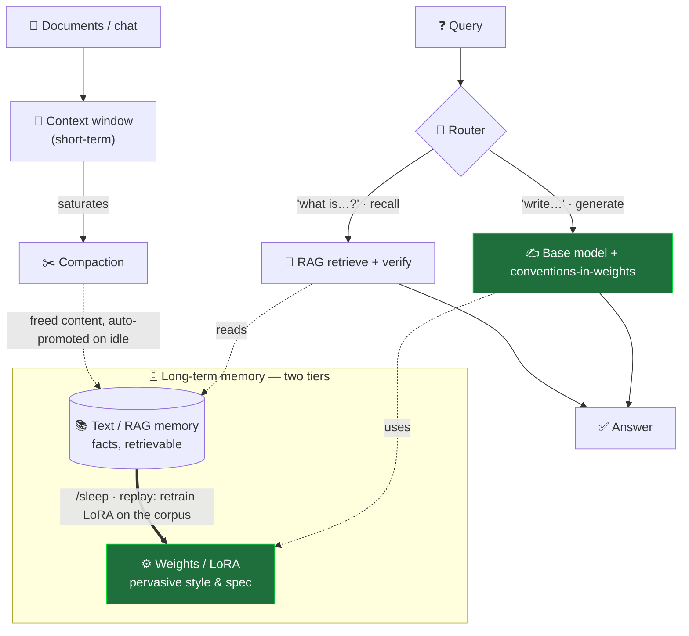

# LLML — a memory layer that makes a *local* LLM actually useful


> Give a small on-device model (Apple Silicon / MLX) a two-tier long-term memory — **your
> project's conventions live in the model's *weights*, the facts live in *external memory*** —
> so a 7B model on your laptop follows a **20,000-token spec at near-zero context cost**, even as
> your codebase fills the window.
>
> Built the honest way: by **measuring when this wins and when it loses.** For raw facts, plain
> RAG wins — and we show you the numbers. For *pervasive style across a big codebase*, it crushes.

---

## 🥇 The result that sells it

One spec, two kinds of knowledge: **pervasive conventions** (apply to *every* file) and
**per-entity facts** (looked up on demand). Generating code for entities the model **never
trained on**:

| method | conventions | facts | context cost |
|---|---|---|---|
| RAG (retrieval) | **29%** ❌ | 100% | 65 tok/call |
| compaction (summary) | 91% | **0%** ❌ | 456 tok/call |
| **LLML (weights + verify)** | **100%** ✅ | **100%** ✅ | **108 tok** |

**RAG can't retrieve the conventions. Compaction can't keep the facts. Only LLML gets both** —
the project-wide rules live in the *weights* (free, always applied), the facts are *verified*
against external memory. *(one benchmark, reproducible: `scripts/benchmark_spec_final.py`.)*

## Where it crushes the alternatives

1. **Pervasive rules RAG literally cannot retrieve.** A retriever ranks by relevance *to your
   query* — so for "implement feature X" it fetches feature X and **misses the project-wide
   conventions** that aren't lexically about X. Weights apply them every time → **100% vs 29%**,
   with the conventions costing **0 added context** (they're baked in).
2. **Context stays free for your code.** With a 20k-token spec, LLML spends **150 context tokens**
   per call vs ~**20,000** for context methods (`benchmark_project.py`). Generate 100 files:
   compaction **re-pays the whole spec 100 times**; LLML pays it once, at training. **~130×.**
3. **It doesn't degrade as the project grows.** When the accumulating code saturates the 32k
   window, compaction's fact accuracy **collapses 50% → 0%**; LLML holds **100/100**, because the
   spec never competes with your code for context.

## Where it *loses* (yes — we'll tell you)

This repo's whole point is honest measurement. So:

- **Open factual recall → use RAG.** Internalizing facts into weights *loses and even degrades
  the base model*: on **SQuAD**, weights **34%** < base **59%** < RAG **88%**.
- **Hard algorithms → that's the model, not the memory.** A 7B caps out (a recursive-descent
  parser: 0–2/16; a 14B with retries gets to 11/16). The memory layer can't add reasoning.

We ship the benchmarks that prove **both** directions → [`BENCHMARKS.md`](BENCHMARKS.md).

## Try it in 2 minutes

```bash
uv venv --python 3.12 .venv && . .venv/bin/activate
uv pip install mlx-lm httpx fastapi uvicorn numpy
# grab an MLX model, e.g. mlx-community/Qwen2.5-7B-Instruct-8bit  ->  models/qwen2.5-7b-it-mlx-8bit

# OpenAI-compatible server — point Open WebUI at http://localhost:8000/v1
M0_BACKEND=mlx M0_MLX_MODEL_PATH=models/qwen2.5-7b-it-mlx-8bit ./.venv/bin/python scripts/serve.py
```

No model handy? `./.venv/bin/python scripts/smoke.py` runs the whole thing on a deterministic
mock backend.

**Then just use it.** Paste your framework docs / coding standard, chat normally. It learns in
the background while you work — no commands needed (see *Automatic mode* below).

## How it works



Inspired by **Complementary Learning Systems** (context = hippocampus, weights = neocortex):
new info enters as context → written to a text/RAG corpus → consolidated into the weights during
a **`/sleep`** cycle (replay). The green path is where LLML differs from a plain RAG bot — your
conventions live in the *weights*, so they apply to every generation for free.

### Automatic mode (on by default — *sleep-time compute*)
You don't type commands. Pasted documents are **auto-indexed** into RAG, and **digested into
long-term memory in the background while you're idle**. `/remember` and `/sleep` are optional
manual overrides. Weight-consolidation stays **opt-in** (`M0_AUTO_SLEEP=1`) — because RAG wins
for facts, we don't auto-bake everything into the weights. *(This is, notably, the same call
Apple Intelligence makes: auto semantic-index, no per-user weight fine-tuning.)*

### Slash commands (optional)
| Command | Effect |
|---|---|
| `/remember` | force a document into long-term memory now |
| `/sleep` | consolidate the corpus into a LoRA (replay) and hot-swap it |
| `/ctxt_clear` | clear context, keep weights + memory (to test weight-recall) |
| `/reset` | wipe everything · `/info` `/state` `/help` |

## Configuration (env vars)

| Variable | Default | Role |
|---|---|---|
| `M0_BACKEND` | `mock` | `mock` \| `mlx` \| `ollama` |
| `M0_MLX_MODEL_PATH` | `models/mlx-3b-4bit` | MLX model dir |
| `M0_AUTO_LEARN` | `1` | auto-index docs + background long-term memory |
| `M0_AUTO_SLEEP` | `0` | opt-in: auto-consolidate to weights when idle |
| `M0_GATE_ACQ` | `0.45` | acquisition gate for `/sleep` |

## Benchmarks

Everything above is reproducible — full tables and honest takeaways (incl. where we lose) in
**[`BENCHMARKS.md`](BENCHMARKS.md)**. Highlights: `benchmark_project.py` (multi-file @32k),
`benchmark_spec_final.py` (2-step), `benchmark_squad.py` (where RAG wins),
`benchmark_rag_vs_grep.py` (a good multi-term grep rivals BM25!), `demo_codeproject.py`
(end-to-end, hidden test suite).

## Honest disclaimer / prior art

None of the *individual* techniques are novel — this is an **integrated, local, honestly-measured
system**. It stands on: RAG-vs-FT (Ovadia et al., arXiv:2312.05934), RAFT (2403.10131),
generate-then-verify / RAC (2410.15667), LoRA capacity & forgetting (2502.14502), and CLS-style
sleep consolidation (2603.14517, 2504.13171). Full write-up: [`RECAP.md`](RECAP.md).

## Architecture (package `m0`)

`config.py` · `llm.py` (MLX/Ollama/mock) · `d2l.py` (LoRA training) · `rag.py` (BM25 + router) ·
`ltm.py` (text corpus) · `compaction.py` · `agent.py` · `scripts/serve.py` (server + auto mode).

## Author
**Romain Decrand--Lardière** — local LLM memory R&D.

## License
MIT © 2026 Romain Decrand--Lardière — see [`LICENSE`](LICENSE).
